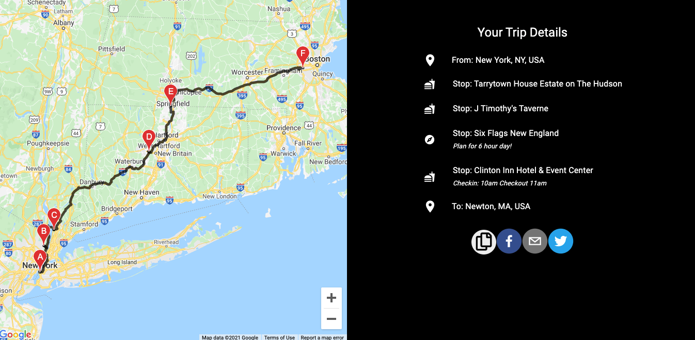

# Big Bad Boston Bikers
## A Trip Planning Application created by Blue Ocean Team

### Contributors
- [David Backer (UI Owner)](https://github.com/DBDavidBacker)
- [Nastassia Fulconis (Architecture Owner)](https://github.com/nastassiafulconis)
- [Tim Kang](https://github.com/tikangcs)
- [Christina Kirk (Product Manager)](https://github.com/KirkNotCaptain) 
- [Zachary Lewitton](https://github.com/zlewitton)
- [Anton Menchaca](https://github.com/amenchaca100)
- [Eddy Santos](https://github.com/EddySantos07)

7 Software Engineers designed and deployed a fullstack trip planning application for a the Big Bad Boston Bikers in 7 days.

This MVP goals of this application were to allow users to plan a trip, receive suggestions for nearby food, lodging, fuel and tourist attractions, and then have the ability to both save the trip and share it (via a url) with others on common social media platforms and email.

## Table of Contents
[Installing Dependencies](#installing-dependencies)

[Technologies Used](#technologies-used)

[Requirements](#requirements)

[Landing Page](#landing-page)

[Trip Planning Dashboard](#trip-planning-dashboard)

[Itinerary Page](#intinerary-page)

[Notes](#Notes)

## Installing Dependencies
- `npm install` - install dependencies
- `npm run build` - build, compile and watch
- `npm start` - start the development server

## Technologies Used
> Back end
- [Express](http://expressjs.com/)
- [Mongodb](https://www.mongodb.com/)

> Front End
- [React](https://reactjs.org/)
- [Redux](https://react-redux.js.org/)
- [Material UI](https://material-ui.com/)

> Deployment
- [Docker](https://www.docker.com/)
- [AWS EC2](https://aws.amazon.com/)

## Requirements
Ensure that the following modules are installed before running npm install

- Node v10.13.10 or higher

## Landing Page
The landing page is where users can enter their origin and destination. Users can click the white travel icon to use their current location as teh starting point. The From and To fields utilize Google Geolocation to auto-suggest locations based on user input. Once the users have chosen starting and ending locations they can click the "Let's Ride" button to move to the trip planning dashboard. 

## Trip Planning Dashboard

The Trip Dashboard is where users can modify their trip. Clicking on the map will generate a list of nearby food, lodging, tourist destinations, and fuel. Users can add any of these suggestions to their trip by clicking on the plus icon. This will update their route to include the stop as a waypoint on the trip and update the Trip Details section to include the new destination. The nearby areas can be sorted by price, proximity to the origin location and rating. 

Users May also add comments to their stop by clicking the pen icon next to the stop name. They can remove the stop from their trip by selecting the remove icon near the stop. The destinations in the trip details will always reflect the order displayed on the route. 

Once users have finished adding stop to their trip, they can click the "save itinerary button" to navigate to the itinerary page. 

## Itinerary Page
Once the user has selected all of their stops and added any optional comments, they will arrive at the Itinerary page which presents them with a summary of their trip. The left side of the page includes an interactive map which displays all their stops, and the right side of the page presents the users with the text overview of their trip. Users have the ability to share this summary page by clicking on one of the four share buttons which will provide links that return to this unique summary page. 

## Notes